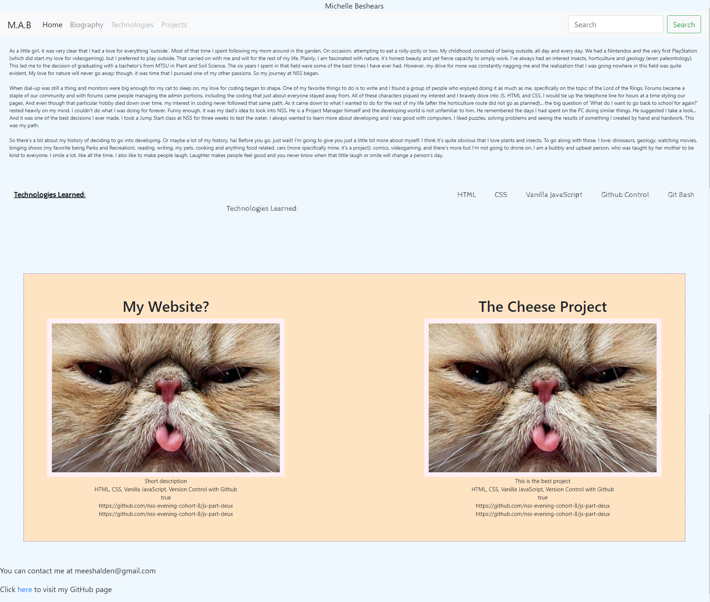

# Personal Bio Site Readme

This project is all about me - not in the selfish kind of way, or at least on purpose. As we progress throughout the year, we will continue to learn developing. These things that I learn will be implemented into my personal website. This website will build on everything by me for me. In the future, when I have finished, this website will be a good personal reference to who I am, the challenges I may have faced and what I ended up learning. The screenshot of this project will continue to change as I progress further.


## Screenshot



## How to run this project
* Use npm to install http-server in your terminal:
```sh
npm install -g http-server
```
* Run the server:
```sh
hs -p 9999
```
* Open Chrome and navigate to 
```
localhost:9999
````